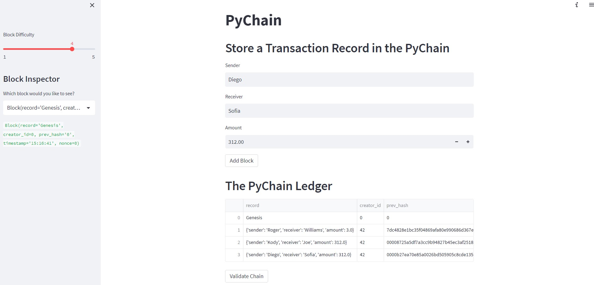
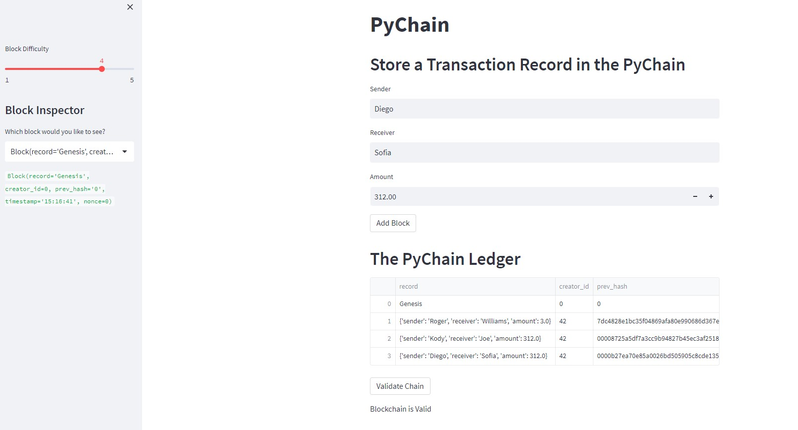

# Blockchain-with-Python
Challenge 18 - University of Berkeley Financial Technology Boot Camp
## PyChain Ledger
The PyChain Ledger program is a blockchain implementation built in Python. It provides a blockchain ledger called PyChain that supports the creation of blocks, performs the proof of work consensus protocol, and validates blocks in the chain. The program includes a user interface built with Streamlit.

## Program Functionality
The PyChain Ledger program offers the following functionality:

### Create a Record Data Class: 
The program defines a data class named Record that represents a transaction record. The Record class has attributes including sender, receiver, and amount to store information about the sender, receiver, and amount of a transaction.

### Modify the Existing Block Data Class to Store Record Data: 
The program modifies the existing Block class to store transaction records. The data attribute of the Block class is renamed to record, and its data type is set to the Record class.

### Add Relevant User Inputs to the Streamlit Interface: 
The Streamlit interface of the program includes input areas for users to provide information about each transaction. Users can enter the sender, receiver, and amount for a transaction.

## Test the PyChain Ledger by Storing Records: 
Users can interact with the Streamlit interface to test the PyChain Ledger. When the "Add Block" button is clicked, a new block is created with the provided transaction details. The block includes a record attribute containing the sender, receiver, and amount values, as well as the creator_id and prev_hash attributes.

# Examples

### The image below shows the blockchain ledger with 3 entries made.

### The image below shows that the blockchain is valid.

